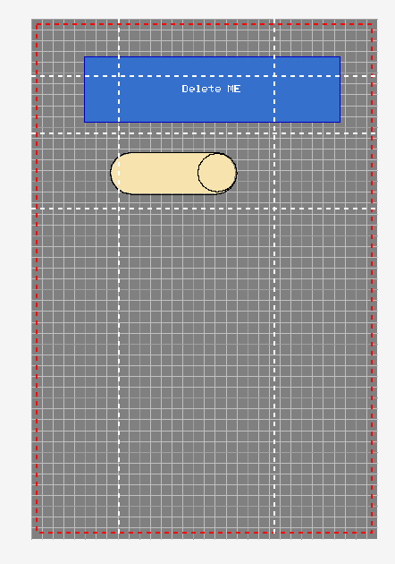

## Snapper

Snapper is a modern solution that makes it easier to align elements evenly and precisely. It replaces the simple grid functionality. Thanks to this feature, we can automatically "snap" elements to such objects as:
1) grid
2) page margins
3) vertical or horizontal guide lines that we can add to the project and set as needed
4) other project elements

With this feature, you can easily position elements at an equal distance, according to the horizontal and vertical distance set in the project. You can configure the operation of this function in various ways. If you want, you can turn off the visibility of the grid, margins, guide lines, or other elements. They will only be visible when you scale or move some elements.

Snapper ribbon menu:

Snapper with all visibility options enabled:

Perfectly aligned elements, every time:

