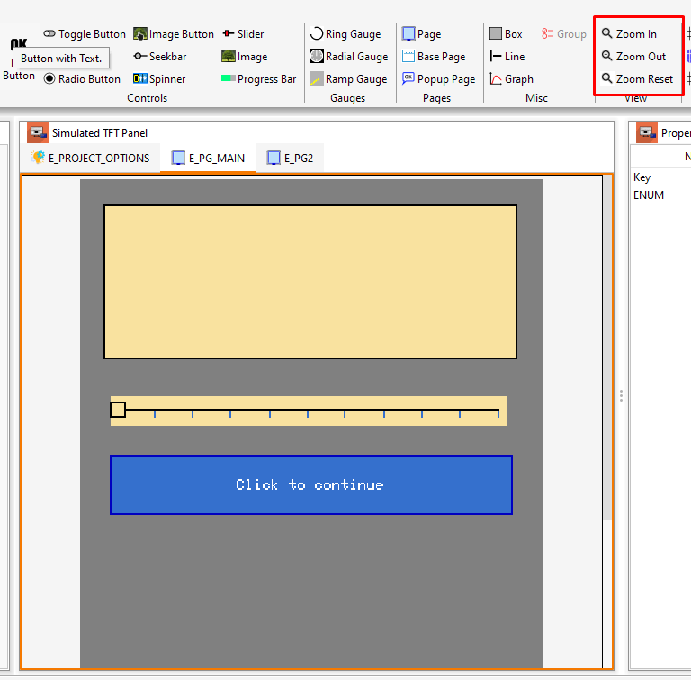
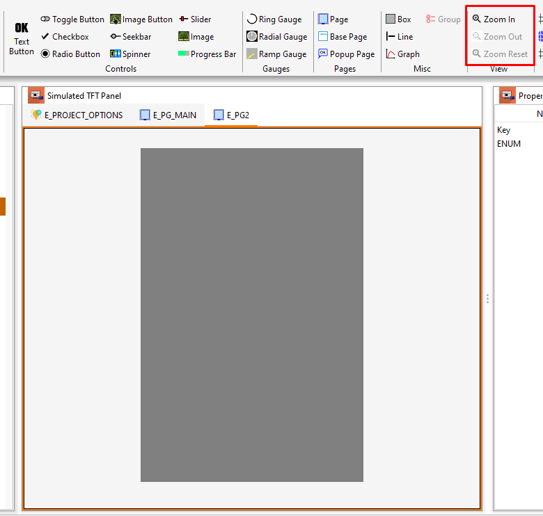

## Zoom defined per page

Because the main reason for using the zoom function is to increase the visibility of a given element on a given page, I think it is not entirely sensible to use one zoom value throughout the entire project. Therefore, I decided to add the ability to change the zoom on each page separately. I also don't see the point of saving this value in the project file.

