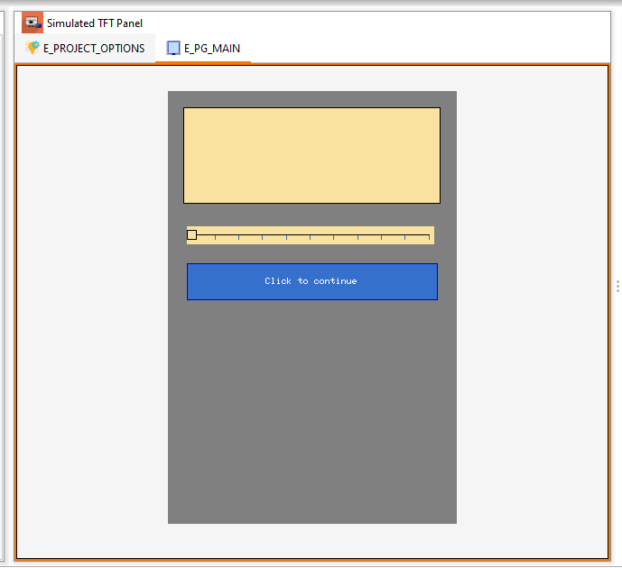
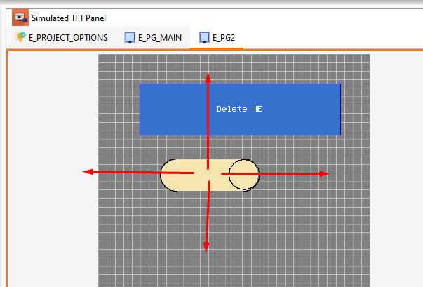
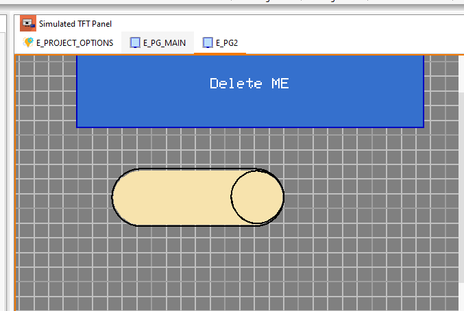

## Centered work area

Majority of modern applications use centering of the work area. This makes the whole work area more visible, and the edge of the window does not distract attention. It also makes it easier to operate objects with the mouse. Some elements can be temporarily moved to the right or left, and they will not disappear beyond the window area.

However, it turned out that the zoom option also required some changes. The previous solution was a bit disorienting because the scaling was done relative to the upper left corner of the work area. At the moment, the application tries to scale relative to the point where the mouse cursor is currently located. In this way, you can quickly and accurately examine the area of interest.

Setting the mouse cursor on the button and using the scaling with the roller should enlarge the view around this button.

