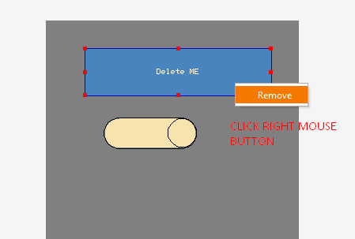

## Contextual menu

One of the mechanisms that greatly facilitate finding the function needed at the moment is the context menu. For example, if we want to delete an object, it is easiest to right-click and select the "delete" option. That is why I decided to add such a menu to the program. For now, it contains only one option.

