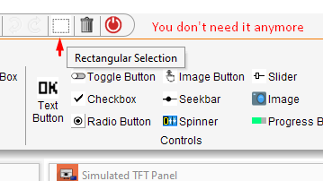
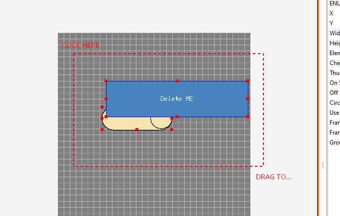

## Simpler rectangular selection

Using the rectangular selection will now be faster. Instead of a special button in the toolbar, just click an empty space in the workspace and drag the mouse to select the desired elements.

Now it is as easy as...

