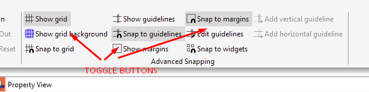
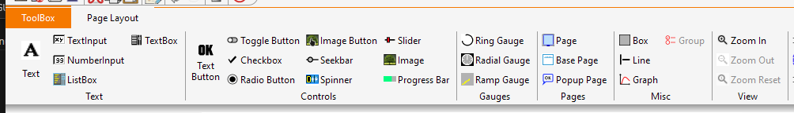
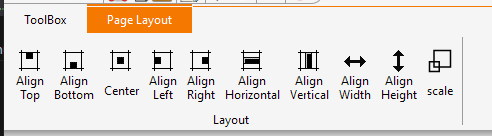

## Better Ribbon Menu

The previous menu had several drawbacks that I decided to change. For example, there was no possibility to add a switch to the menu. There were also no context cursors, which greatly facilitate understanding whether a given option can be selected at the moment. I also changed some of the icons. They are not perfect, but a little better than before.

